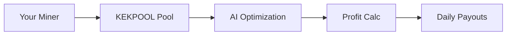

## Overview

KEKPOOL revolutionizes cryptocurrency mining with AI-powered optimization that dynamically adjusts algorithms to boost your hashrate efficiency. You mine Kaspa (`KAS`) and other supported coins while accessing real-time insights into pool performance. Track active miners, calculate potential profits, and receive instant daily payouts with minimal fees. These features ensure you maximize rewards in a competitive landscape.

<Callout kind="info">
  All features integrate seamlessly with popular miners like lolMiner and TeamRedMiner.
</Callout>

## Key Features

Discover the standout capabilities that set KEKPOOL apart.

<Columns cols={3}>
  <Card title="Real-time Monitoring" icon="activity" href="#real-time-monitoring">
    Monitor pool hashrate and active miners live.
  </Card>
  <Card title="Profit Calculator" icon="trending-up" href="#profit-calculator">
    Estimate earnings based on your setup.
  </Card>
  <Card title="Instant Payouts" icon="credit-card" href="#instant-payouts">
    Low-fee daily withdrawals.
  </Card>
</Columns>

## Real-time Monitoring

Gain full visibility into pool operations with dashboards updating every few seconds. View total hashrate (e.g., `>500 PH/s`), number of active miners (`>10,000`), and your personal stats.

### Access the Dashboard

<Steps>
  <Step title="Log In" icon="log-in">
    Visit [https://kekpool.com](https://kekpool.com) and enter your wallet address.
  </Step>
  <Step title="View Stats" icon="bar-chart-3">
    Navigate to the dashboard for live metrics.
  </Step>
  <Step title="Set Alerts" icon="bell">
    Configure notifications for hashrate drops.
  </Step>
</Steps>

Use the public API for integration:

<CodeGroup tabs="JavaScript,cURL">
  ```javascript
  const response = await fetch('https://api.kekpool.com/stats');
  const data = await response.json();
  console.log(`Pool hashrate: ${data.hashrate} PH/s`);
  console.log(`Active miners: ${data.miners}`);
  ```
  ```bash
  curl "https://api.kekpool.com/stats"
  ```
</CodeGroup>

## Profit Calculator

Estimate your daily rewards effortlessly. Input your hashrate, power cost, and efficiency to see projected `KAS` earnings.



<Expandable title="Advanced Calculator Usage" default-open="false">

Customize with JavaScript:

````javascript
function calculateProfit(hashrateThs, powerKw, costKwh) {
  const kasPrice = 0.12; // USD per KAS
  const poolFee = 0.01;
  const dailyKas = (hashrateThs * 0.0001) * (1 - poolFee);
  const powerCost = powerKw * 24 * costKwh;
  return (dailyKas * kasPrice) - powerCost;
}

console.log(calculateProfit(100, 2.5, 0.12)); // ~$2.15 net profit
````

</Expandable>

## Instant Payouts and Fees

Enjoy payouts directly to your wallet every 24 hours once you reach the `0.1 KAS` threshold. Fees are only `1%`—far below industry averages.

<Tabs>
  <Tab title="KAS Payout" icon="coin">
    Automatic daily transfer. No manual claims needed.
  </Tab>
  <Tab title="Fee Structure" icon="percent">
    
    | Tier       | Fee  | Min Payout |
    |------------|------|------------|
    | Standard   | 1%   | 0.1 KAS   |
    | Pro        | 0.5% | 1 KAS     |

  </Tab>
  <Tab title="Setup Payout" icon="settings">
    Configure in dashboard:

````json
{
  "payoutAddress": "kaspa:your-wallet-address-here",
  "threshold": "0.1",
  "frequency": "daily"
}
````

  </Tab>
</Tabs>

<Callout kind="tip" kind="success">
  Upgrade to Pro for halved fees and priority support.
</Callout>

## Best Practices

- Monitor hashrate regularly to catch issues early.
- Use the profit calculator before scaling rigs.
- Link to [Quickstart](/quickstart) for miner setup.

These features empower you to mine smarter with KEKPOOL.