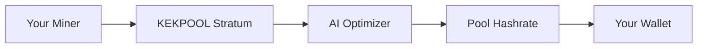

## Overview

KEKPOOL revolutionizes cryptocurrency mining with AI-powered optimization that dynamically adjusts hashing strategies to maximize your efficiency. You mine Kaspa (`KAS`) and other supported coins through our secure, low-fee pool at `pool.kekpool.com`. Track real-time hashrate, active miners, and earnings via the dashboard at `https://dashboard.kekpool.com`. Enjoy instant daily payouts without thresholds and use our profit calculator to forecast rewards based on your hardware.

Join thousands of miners leveraging KEKPOOL's intelligent algorithms to stay profitable in volatile markets. Our platform minimizes downtime and optimizes power usage, giving you an edge over traditional pools.

## Key Features

<Columns cols={3}>
  <Card title="AI Optimization" icon="zap" href="#ai-optimization">
    Machine learning algorithms auto-tune your miners for peak performance, boosting hash rates by up to `30%`.
  </Card>
  <Card title="Real-Time Tracking" icon="activity" href="#tracking">
    Monitor pool hashrate, shares, and miner stats live on the dashboard.
  </Card>
  <Card title="Instant Payouts" icon="dollar-sign" href="#payouts">
    Receive daily payments with `0.5%` fees—no minimums required.
  </Card>
</Columns>

<Expandable title="Learn More About Features" default-open="true">
  Explore advanced tools like profit calculators and community forums for deeper insights.
</Expandable>

## Quick Start

Get mining in minutes with these steps:

<Steps>
  <Step title="Create Account" icon="user-plus">
    Sign up at `https://dashboard.kekpool.com/register` with your email and wallet address.
  </Step>
  <Step title="Configure Miner" icon="settings">
    Point your mining software to our stratum server. Use worker name format: `yourusername.rig1`.
  </Step>
  <Step title="Start Mining" icon="play">
    Launch your miner and monitor hashrate on the dashboard.
  </Step>
  <Step title="Track Earnings" icon="bar-chart-3">
    View real-time stats and request payouts anytime.
  </Step>
</Steps>

<Callout kind="tip">
  Use our profit calculator at `https://kekpool.com/calculator` to estimate daily rewards based on your GPU hashrate and power costs.
</Callout>

## Miner Configuration Examples

Configure popular miners for Kaspa (`KAS`) mining:

<CodeGroup tabs="lolMiner,BeeMiner">
  ````bash
  lolMiner.exe --algo KASPA --pool stratum+tcp://pool.kekpool.com:3333 --user YOUR_WALLET.worker1 --pass x
  ````

  ````bash
  bee-miner --algo 144_5 --url stratum+tcp://pool.kekpool.com:3333#worker=YOUR_WALLET.rig1
  ````
</CodeGroup>

<Tabs>
  <Tab title="Kaspa (KAS)" icon="coin">
    Primary coin with highest rewards. Stratum: `pool.kekpool.com:3333`.
  </Tab>
  <Tab title="Other Coins" icon="layers">
    Support for additional coins coming soon. Check dashboard for updates.
  </Tab>
</Tabs>

## Benefits of Joining KEKPOOL

You gain access to a vibrant community of miners sharing tips on hardware optimization. Our AI reduces stale shares and variance, ensuring stable income. Calculate profits easily:

| Hardware | Hashrate | Power (W) | Daily Profit (est.) |
|----------|----------|-----------|---------------------|
| RTX 4090 | `120 KH/s` | `350` | `$2.50` |
| RTX 3080 | `65 KH/s`  | `220` | `$1.20` |

<Columns cols={2}>
  <Card title="Next: Quickstart Guide" icon="book-open" href="/quickstart">
    Detailed setup for all rigs.
  </Card>
  <Card title="Authentication" icon="shield" href="/authentication">
    Secure your account and API access.
  </Card>
</Columns>



With KEKPOOL, you mine smarter, not harder. Start today and maximize your crypto rewards.